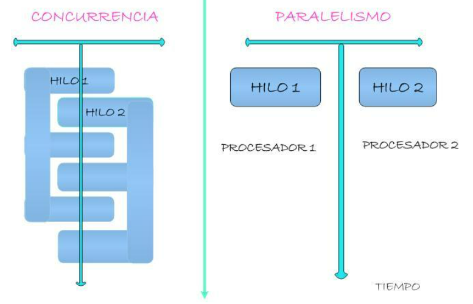

# 1. PROGRAMAS, EJECUTABLES, PROCESOS

- **Sistema operativo**: software que coordina el funcionamiento del resto de componentes tanto software como hardware.**

Proceso de creación de un programa y su ejecución posterior:

1. Programador: escribe código fuente en un fichero de texto. (.java)
2. Compilador: transforma el fichero en un programa ejecutable (si es compilado), con instrucciones comprensibles por el sistema operativo.
3. El usuario ejecuta el programa, generando un proceso.

**LA EJECUCIÓN DE UN PROGRAMA GENERA UN PROCESO EN EL SISTEMA OPERATIVO**

**UN PROCESO ES UN PROGRAMA EN EJECUCIÓN**

*Windows, los procesos pueden verse en el Administrador de tareas*

*En linux ps aux | grep nombreproceso o bien la aplicación Monitor del Sistema*

Esto cuando el programa es compilado; cuando es interpretado el proceso que arranca es el intérprete (por ejemplo, el browser).

# 2. Computación concurrente y paralela

**Sistema operativo multitarea** significa que puede ejecutar más de un proceso a la vez. Todos los actuales, salvo los muy antiguos como MS-DOS.

En los sistemas multitarea los procesos avanzan a la vez, aunque no de la misma forma ni al mismo ritmo.

## a) Sistema operativo con un único procesador y un único núcleo.

*Para ver el número de procesadores / núcleos:*

- *En Windows: Administrador de tareas > Rendimiento > CPU*
- *En linux: lscpu*

Este tipo de sistemas lleva a cabo la multitarea mediante **concurrencia:** los tiempos de CPU se alternan entre los distintos de forma tan rápida que parece que se ejecutan simultáneamente.

Es importante destacar que

**EN PROCESAMIENTO CONCURRENTE TODOS LOS PROCESOS AVANZAN SIN QUE TENGAN QUE ESPERARSE UNOS A OTROS.**

## b) Sistema operativo con varios procesadores y/o varios núcleos.

Aquí se pueden ejecutar varias instrucciones de un mismo proceso en el mismo ciclo de reloj. Y cuando esto sucede hablamos de **procesamiento paralelo.**

En el procesamiento paralelo los procesos se dividen en tareas llamadas **hilos (thread) que se ejecutan en diferentes núcleos.**

EN RESUMEN:

- **PROCESAMIENTO CONCURRENTE:** varios procesos se ejecutan en una misma CPU alternativamente, permitiendo que avancen simultáneamente y evitando la secuencialidad de los sistemas monotarea.

- **PROCESAMIENTO PARALELO:** diferentes tareas (hilos) de un mismo proceso se ejecutan simultáneamente en diferentes núcleos de un procesador o en diferentes procesadores..

El procesamiento concurrente lo gestiona el sistema operativo.

El procesamiento paralelo lo gestionan el sistema operativo y el programa, conjuntamente.
 

 

# 3. Programación distribuida

La ejecución del software se reparte entre varios ordenadores conectados en red, lo que multiplica la potencia de procesamiento y escalabilidad (se puede ampliar añadiendo tantos ordenadores como se necesiten). Son sistemas más eficientes y (normalmente) más económicos.

- PROCESAMIENTO DISTRIBUIDO: aquel en el que un proceso se ejecuta en unidades de computación independientes conectadas y sincronizadas.

# 4. Hilos

Un programa básico se ejecuta de forma **síncrona**: en orden secuencial, y hasta que no se completa una instrucción no se pasa a la siguiente.

Pero hay casos en que puede dividirse el programa en grupos de instrucciones que pueden ejecutarse en paralelo porque son independientes entre sí. Esto se llama **programación multihilo**.