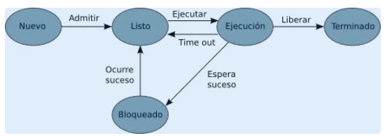

En los sistemas operativos multitarea es el **planificador de procesos**, un elemento del sistema operativo, quien se encarga de conseguir que todos los procesos terminen lo antes posible aprovechando al máximo los recursos del sistema.

Para gestionar los procesos el planificador necesita conocer el estado en que se encuentran, que puede ser (de forma simplificada):

- **Nuevo**: técnicamente no es un estado, sino que representa el momento en que se crea el proceso.
- **Listo**: el proceso está en memoria, preparado para ejecutarse.
- **En ejecución**: el proceso se encuentra en ejecución.
- **Bloqueado**: el proceso está a la espera de que ocurra un evento externo ajeno al planificador.
- **Finalizado**: tampoco es técnicamente un estado, sino que representa el momento posterior a la finalización del proceso.

Recuerda: ni el programador ni el usuario tienen control sobre los estados de un proceso, ya que su ciclo de vida es responsabilidad exclusiva del planificador de procesos del sistema operativo.