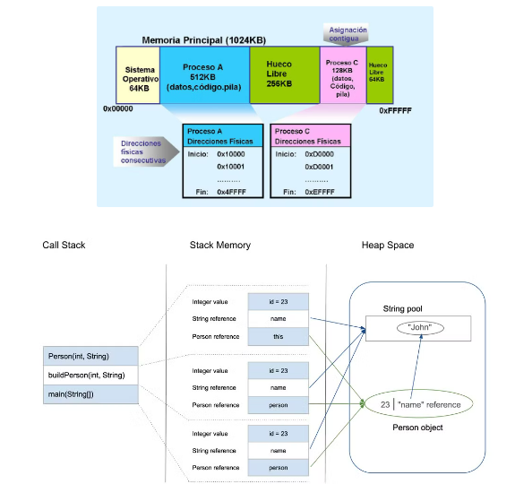

Recuerda: un proceso es un programa en ejecución.

**Cada proceso está compuesto por**

- **Instrucciones que se van a ejecutar**: Son el conjunto de operaciones o tareas que el programa debe realizar, contenidas en el código ejecutable. Estas instrucciones son cargadas en memoria cuando el proceso comienza su ejecución.
- **Estado del propio proceso**: Se refiere a la fase en la que se encuentra el proceso durante su ciclo de vida (nuevo, listo para ejecución, en ejecución, bloqueado o finalizado).
- **Estado de la ejecución**: Incluye los valores de los registros de la CPU (como el contador de programa o el puntero de pila), que almacenan el contexto de la ejecución en un momento dado. Esto permite que, si un proceso se interrumpe, pueda continuar desde donde fue pausado.
- **Estado de la memoria**: Describe la asignación de memoria del proceso, que incluye el código (segmento de código), los datos estáticos (segmento de datos), el heap (memoria dinámica), y la pila o stack (donde se almacenan las variables locales y el seguimiento de las llamadas a funciones).

En la programación concurrente los procesos están continuamente entrando y saliendo del procesador. Se denomina contexto a toda la información que determina el estado de un proceso en un momento dado. Es como una fotografía que se toma del proceso cuando tiene que abandonar el procesador sin haber finalizado, para retomar la ejecución donde la dejó cuando vuelva a tomar posesión del procesador.