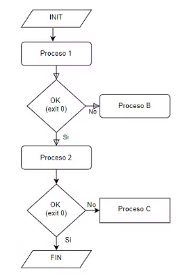

En programación concurrente a veces tiene que haber sincronización entre procesos. Por ejemplo, podemos necesitar saber si un proceso finaliza correctamente para ejecutar un determinado proceso, y si falla ejecutar otro.
 

Para gestionar un flujo de trabajo así se necesitan los siguientes mecanismos: 

| Mecanismo	                                                                                                                    | Descripción |	Clase Java | Método Java |
|-------------------------------------------------------------------------------------------------------------------------------|-------------|------------|-------------|
| Ejecución                                                                                                                     | Ejecutar procesos desde un proceso |Runtime |exec()|
|                                                                                                                               | |ProcessBuilder | start() |
| Espera                                                                                                                        | Bloquear un proceso hasta que termine otro |	Process |	waitFor() |
| Generar código de finalización | Para indicar a un proceso cómo ha terminado la ejecución de otro | System |	exit(valor de retorno) |
|Obtener código de finalización |	Para obtener el código de finalización de otro proceso |	Process | waitFor() |
_Ver ejemplo de sincronización_

_Ejemplo (ficticio) de códigos de finalización_

| Código de finalización | Descripción |
|------------------------|-------------|
| 0                      | El proceso ha finalizado correctamente. |
| 1                      | No se puede establecer la conexión con la base de datos. |
| 2                      | No se puede establecer la conexión con el servicio web del IPC. |
| 3                      | El valor de referencia del IPC no es numérico. |
| 4                      | Las credenciales del servicio de correo electrónico no son válidas. |